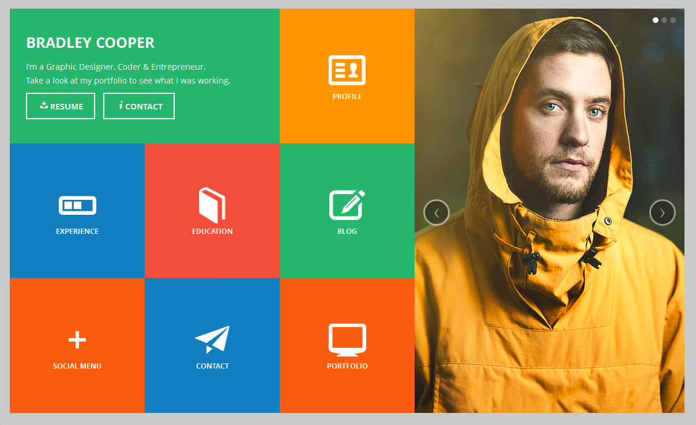
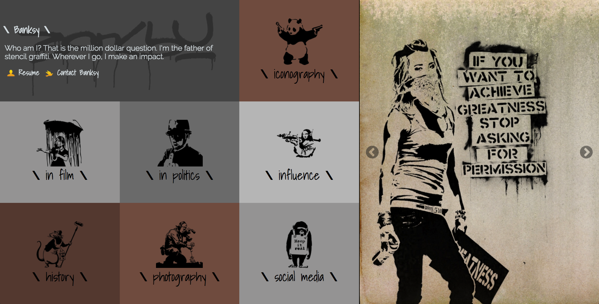
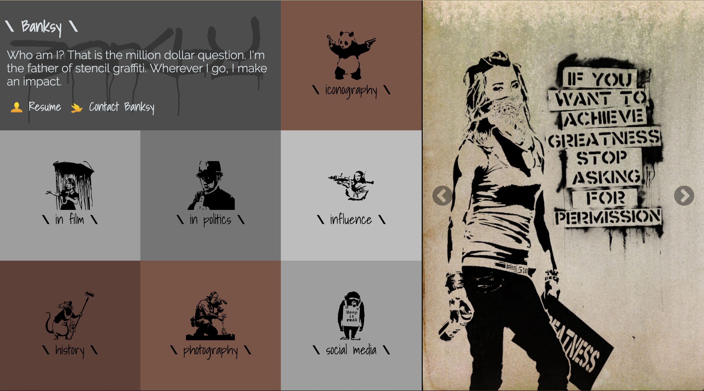
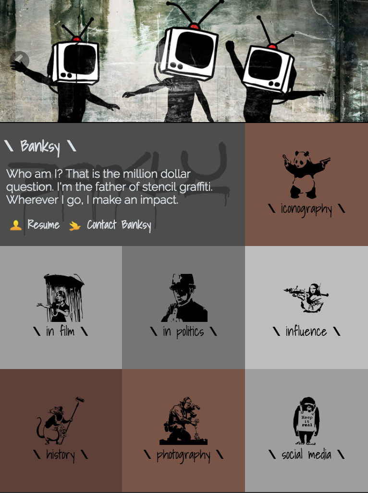
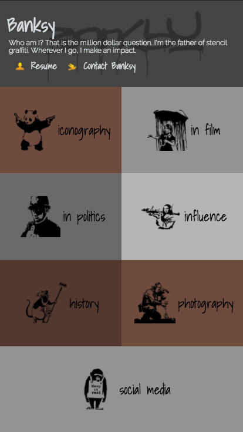
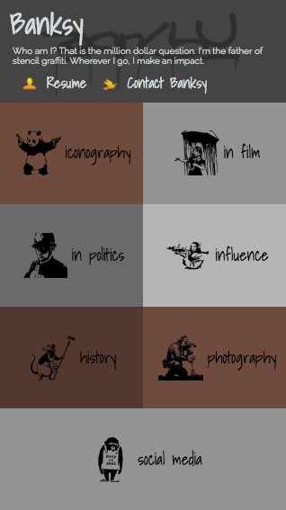

# Static Comp Challenge 1, a Turing M1FEE project

This is the Static Comp Challenge 1 project for Turing. The goal of this project is to demonstrate an understanding of HTML and CSS3, while also demonstrating an adequate understanding of FlexBox. The original requirements can be found [here](http://frontend.turing.io/projects/m1-static-comp-1.html).

#### Original Comp

#### Final - Large Monitor

#### Final - 15" Laptop

#### Final - iPad (768 x 1024)

#### Final - iPhone 6 (375 x 667)

#### Final - iPhone 5 (320 x 568)

## Getting Started

This is a straightforward application. Download the repository and browse to `index.html`.

### Prerequisites

N/A

### Installing

As mentioned above, simply download the repository and browse to `index.html`.

## Running the application

To run the app, you will need to simply deploy it to a web server and browse to the `index.html` file. Alternatively, you can run the code locally by opening the local copy of `index.html` in your web browser.

## Deployment

N/A

## Built With

* [HTML](https://developer.mozilla.org/en-US/docs/Web/HTML) - Hyper Text Markup Language - The markup language used to build this project.
* [CSS3](https://developer.mozilla.org/en-US/docs/Web/CSS/CSS3) - Cascading StyleSheets v3 - The styling framework used to build this project.

## Contributing

N/A

## Versioning

N/A

## Authors

* **Jason Collins** - [The OEM](https://github.com/the-oem)

## License

N/A
<!-- This project is licensed under the MIT License - see the [LICENSE.md](LICENSE.md) file for details -->

## Acknowledgments

* Hat tip to the Turing M1FEE instructors for their assistance
* As always, I couldn't have done this without the support of my tribe, Cohort 1703FE!
